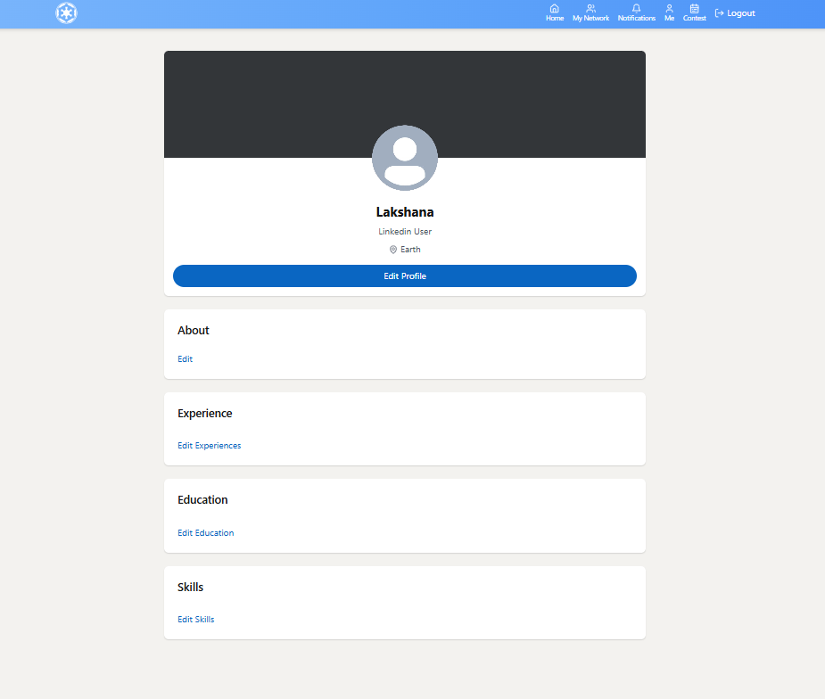
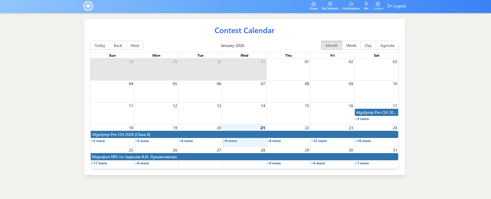
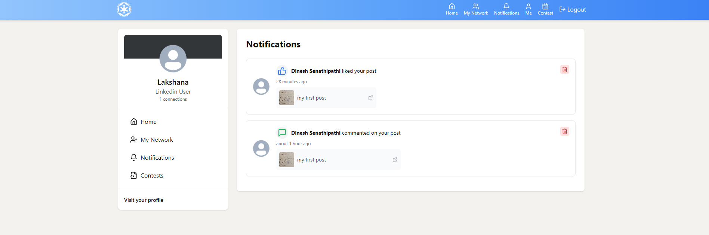
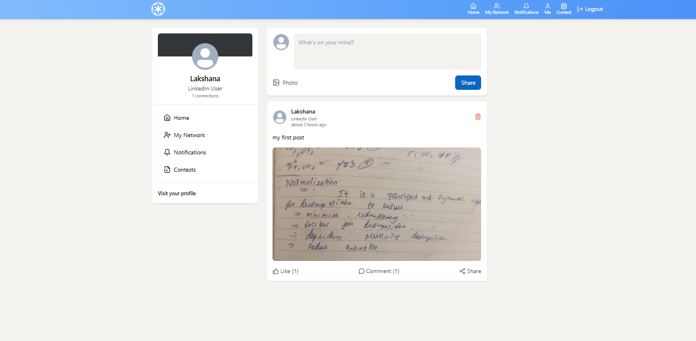

# Aura Connect

A professional networking platform inspired by LinkedIn, built with the MERN stack. Connect with professionals, share posts, track coding contests, and grow your network.

## Screenshots

### User Profile

*Professional profile page with customizable sections for experience, education, and skills*

### Contest Calendar

*Interactive calendar showing upcoming coding contests from various platforms*

### Notifications

*Real-time notification system for likes, comments, and connection requests*

### Social Feed

*Engage with your network through posts, likes, and comments*

> **Note:** To add screenshots, place your images in a `screenshots` folder at the root of the project.

## Features

### 🔐 Authentication & Authorization
- Secure user registration and login with JWT
- Password encryption with bcryptjs
- Protected routes and session management

### 👤 User Profiles
- Customizable profile with photo, headline, and bio
- Add experience, education, and skills
- View and edit your professional information
- Profile picture upload with Cloudinary integration

### 📱 Social Feed
- Create and share posts with text and images
- Like and comment on posts
- Real-time feed updates every 30 seconds
- Delete your own posts

### 🔔 Notifications
- Get notified when someone likes your post
- Receive notifications for comments
- Connection request notifications
- Auto-mark notifications as read when viewed
- Real-time notification badge

### 🤝 Networking
- Send and receive connection requests
- Accept or reject connection requests
- View your network of connections
- Discover recommended users to connect with

### 🏆 Contest Calendar
- View upcoming coding contests from multiple platforms
- Interactive calendar view powered by react-big-calendar
- Add contests to your wishlist
- Track ongoing contests with floating widget
- Integration with CLIST API for contest data

## Tech Stack

### Backend
- **Node.js** - Runtime environment
- **Express.js** - Web framework
- **MongoDB** - Database with Mongoose ODM
- **JWT** - Authentication tokens
- **Cloudinary** - Image storage and management
- **Mailtrap** - Email service for notifications
- **Axios** - HTTP client for external APIs

### Frontend
- **React 18** - UI library
- **Vite** - Build tool and dev server
- **TanStack Query** - Data fetching and caching
- **React Router** - Client-side routing
- **Tailwind CSS** - Utility-first CSS framework
- **DaisyUI** - Tailwind component library
- **React Big Calendar** - Calendar component
- **Lucide React** - Icon library
- **React Hot Toast** - Toast notifications

## Project Architecture

### System Design
- **RESTful API** architecture for backend services
- **Component-based** frontend with React
- **JWT-based** authentication and authorization
- **Real-time updates** with polling mechanism
- **Optimistic UI** updates for better user experience

### Database Schema
- **Users** - Profile information, connections, and authentication
- **Posts** - Content, images, likes, and comments
- **Notifications** - User activity tracking
- **Connection Requests** - Network relationship management
- **Contests** - Coding competition data and user wishlists

### Key Features Implementation

#### Authentication Flow
- Secure password hashing with bcryptjs
- JWT token generation and validation
- Cookie-based session management
- Protected API routes with middleware

#### Social Features
- Post creation with image upload to Cloudinary
- Like/unlike with optimistic UI updates
- Nested comments system
- Real-time notification system

#### Contest Integration
- External API integration with CLIST
- Contest wishlist management
- Ongoing contest tracking
- Calendar visualization with react-big-calendar

## API Endpoints

### Authentication
- `POST /api/v1/auth/signup` - Register new user
- `POST /api/v1/auth/login` - User login
- `POST /api/v1/auth/logout` - User logout

### Users
- `GET /api/v1/users/suggestions` - Get recommended users
- `GET /api/v1/users/:username` - Get user profile
- `PUT /api/v1/users/profile` - Update profile

### Posts
- `GET /api/v1/posts` - Get feed posts
- `POST /api/v1/posts/create` - Create new post
- `DELETE /api/v1/posts/delete/:id` - Delete post
- `POST /api/v1/posts/:id/like` - Like/unlike post
- `POST /api/v1/posts/:id/comment` - Add comment

### Connections
- `GET /api/v1/connections/requests` - Get connection requests
- `POST /api/v1/connections/request/:userId` - Send connection request
- `PUT /api/v1/connections/accept/:requestId` - Accept request
- `PUT /api/v1/connections/reject/:requestId` - Reject request

### Notifications
- `GET /api/v1/notifications` - Get user notifications
- `PUT /api/v1/notifications/:id/read` - Mark as read
- `DELETE /api/v1/notifications/:id` - Delete notification

### Contests
- `GET /api/v1/coding/contest` - Get upcoming contests
- `POST /api/v1/coding/add-contest` - Add contest to wishlist
- `GET /api/v1/coding/getOngoingContest` - Get ongoing contests

## Features in Detail

### Real-time Updates
- Posts automatically refresh every 30 seconds
- Optimistic UI updates for likes
- Instant notification badge updates

### Responsive Design
- Mobile-first approach with Tailwind CSS
- LinkedIn-inspired color scheme
- Smooth animations and transitions

### Error Handling
- Comprehensive error messages
- Graceful fallbacks for API failures
- User-friendly error displays

## Author

**Lakshana**

## Acknowledgments

- LinkedIn for design inspiration
- CLIST API for contest data
- All open-source libraries used in this project
